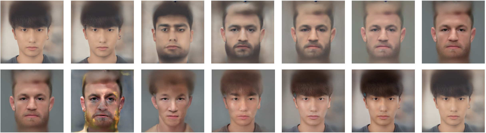
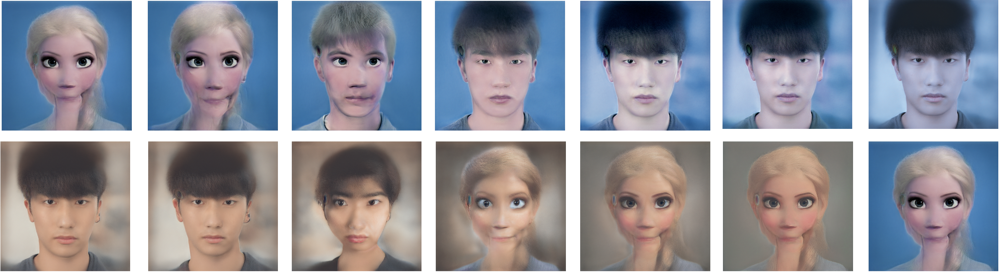

# FaceEmbedding


Original Codes from : 

https://github.com/Puzer/stylegan-encoder/

https://github.com/jacobhallberg/pytorch_stylegan_encoder

Do align the input images before you do the tasks below:

Align raw images
```bash
python align_images.py PATH_TO_RAW_IMAGES/ PATH_TO_ALIGNED_IMAGES/
```

## 1. EasttoWest

Embed Eastern Faces to Western Faces using StyleGAN.


**Figure:** *Embedding result for a Korean celebrity.*

### Usage

I used the pre-trained models from https://github.com/jacobhallberg/pytorch_stylegan_encoder/releases/tag/v1.0 . As mentioned, place the StyleGAN model in ./InterFaceGAN/models/pretrain/ . Place the Image To Latent model at the root of the repo.


1) Convert images using Pre-trained StyleGAN.
```bash
python main.py --aligned_path PATH_TO_ALIGNED_IMAGES/ --output_path PATH_TO_OUTPUTS/
```


**Figure:** *Embedding result for Korean celebrities, a game character and myself.*

As shown above, the model severely distorts the identity of original inputs sometimes. I will focus more on fixing StyleGAN Encoder to address this.

## 2. FaceBlending

Mixing two input faces. I mixed my face with Conor Mcgregor's.



### Usage

1) Extract latent representations of a pair of input images.
```bash
python encode_image.py PATH+NAME_OF_ALIGNED_IMAGE_1 SAVING_PATH_1 --save_optimized_image True --iterations 1000 --use_latent_finder True
```
```bash
python encode_image.py PATH+NAME_OF_ALIGNED_IMAGE_2 SAVING_PATH_2 --save_optimized_image True --iterations 1000 --use_latent_finder True
```

This might take 2~3 minutes per image.


2) Blend input images with extracted latents.
```bash
python blend.py --latent1_path SAVING_PATH_1 --latent2_path SAVING_PATH_2
```
Below will yield a different result from above. So, try it!
```bash
python blend.py --latent1_path SAVING_PATH_2 --latent2_path SAVING_PATH_1
```

For a sheer curiosity, I mixed myself with an animation character, Elsa. It shows quite reasonable mixture as below.



Additionally, when I use a blending technique, I can get better embedding of my face to western.


