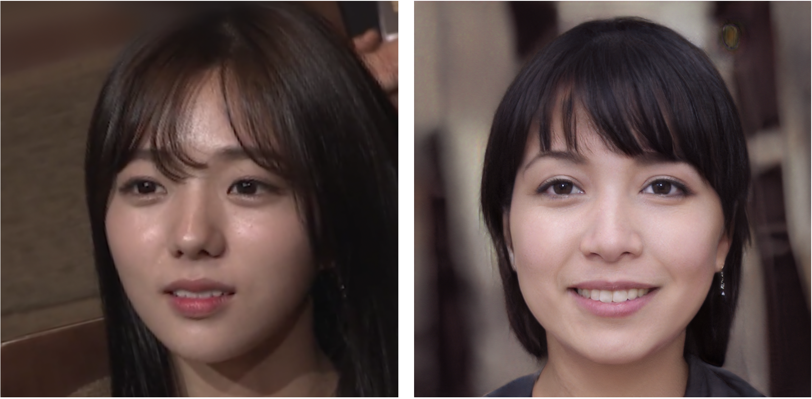
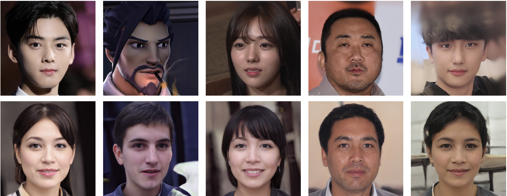

# EasttoWest


Embed Eastern Faces to Western Faces using StyleGAN.


**Figure:** *Embedding result for a Korean celebrity.*

Original Codes from : 

https://github.com/Puzer/stylegan-encoder/

https://github.com/jacobhallberg/pytorch_stylegan_encoder

# Usage

I used the pre-trained models from https://github.com/jacobhallberg/pytorch_stylegan_encoder/releases/tag/v1.0 . As mentioned, place the StyleGAN model in ./InterFaceGAN/models/pretrain/ . Place the Image To Latent model at the root of the repo.

1) Align raw images
```bash
python align_images.py PATH_TO_RAW_IMAGES/ PATH_TO_ALIGNED_IMAGES/
```

2) Convert images using Pre-trained StyleGAN.
```bash
python main.py --aligned_path PATH_TO_ALIGNED_IMAGES/ --output_path PATH_TO_OUTPUTS/
```


**Figure:** *Embedding result for Korean celebrities, a game character and myself.*

As shown above, the model severely distorts the identity of original inputs sometimes. I will focus more on fixing StyleGAN Encoder to address this.
